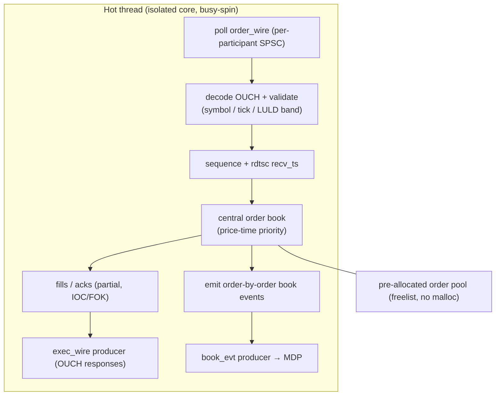
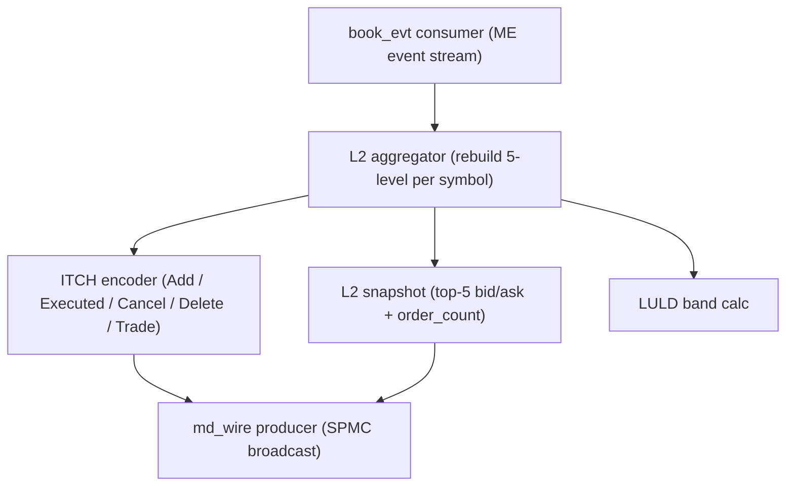
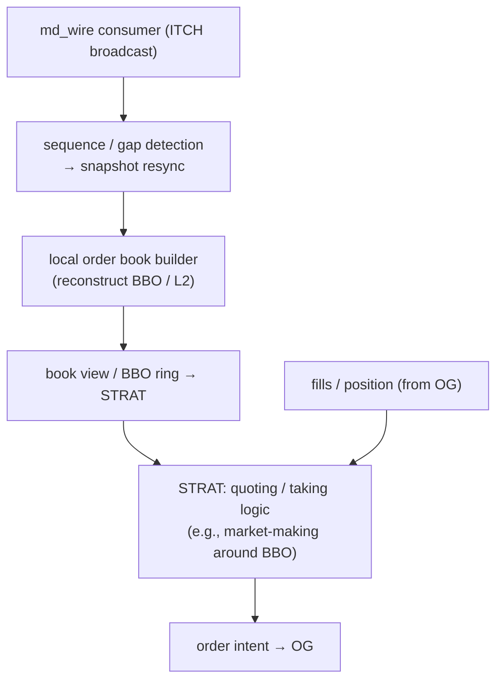
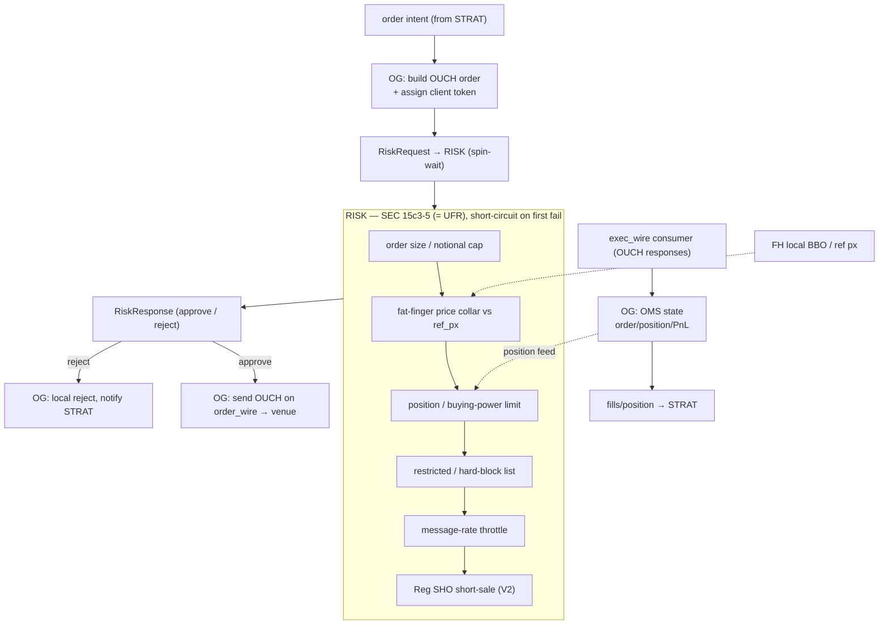
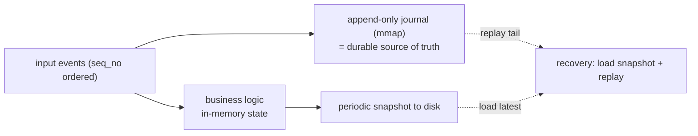

# Architecture — Low-Latency Equities Trading System (US Market)

A simplified, **industrially-faithful** low-latency trading stack modeled on US equities market
structure. It is **two-sided**:

- a **VENUE** side — a *simulated exchange*: a price-time matching engine + an ITCH-style market
  data publisher + an order acceptor; and
- a **PARTICIPANT** side — a *trading participant* (the buy-side/HFT and the broker market-access
  layer): a feed handler that rebuilds a local book from the venue's ITCH, a strategy, a
  SEC 15c3-5 pre-trade risk gate, and an order gateway that sends OUCH to the venue.

The two sides talk across a realistic **protocol boundary** (OUCH for order entry, ITCH for market
data). Each side is single-machine, multi-process, shared-memory IPC — the topology used by
production low-latency systems.

> **Why two-sided (read this first).** Matching does **not** happen inside a broker/participant
> system — it happens at the exchange. The author's production experience (Hundsun UFT / UFR /
> reference-data node) is entirely **participant/broker side**: route orders to the exchange, gate
> them through risk, consume the exchange's reference data — *no local matching*. This project
> therefore separates the **exchange** (where the matching engine genuinely lives) from the
> **participant** (where the author's UFT/UFR experience maps exactly). Building both — and the
> protocol boundary between them — is the complete, honest story. See ADR-0006.

> **Scope is deliberately narrow.** One venue, one symbol class (equities), simulated counterparty
> flow, custom binary framing of OUCH/ITCH in V1. Goal: *clean engineering + honest benchmarks +
> a story that holds up under 30 minutes of interview scrutiny*, not a production exchange.

---

## 1. Design goals & non-goals

**Goals**
- Modern C++20, single-machine multi-process, two-sided (venue + participant).
- Latency targets (measure and publish actuals; never inflate):
  - **tick-to-trade p99** (participant: ITCH-in → strategy decision → OUCH-out) — single-digit µs.
  - **venue order→ack p99** — single-digit µs.
- Demonstrable mastery of: lock-free SPSC/SPMC rings, shared-memory IPC, CPU affinity,
  cache-line-aware data structures, price-time matching, **local book building from a feed**,
  ITCH/OUCH protocols, SEC 15c3-5 pre-trade risk as an independent process.
- **All-in-memory**: memory is the system of record; no database on the hot path; pre-allocated
  pools, `mlock` + huge pages; journal-based persistence and active-standby HA (see §9).
- Full engineering hygiene: CMake, GoogleTest, Google Benchmark, HdrHistogram, GitHub Actions CI, docs.

**Non-goals (V1)**
- No GUI / web frontend.
- No real exchange connectivity (the *simulated* venue is the counterparty).
- No NBBO/SIP, no multi-venue routing (single venue).
- No distributed/sharded matching (real cores are single-machine; we stay faithful).
  *Active-standby HA across a node pair is the one form of multi-node we embrace — see §9.5.*
- No FIX in V1 (custom binary OUCH/ITCH framing); FIX 4.4 order entry arrives in V2 **off the hot path**.
- Not production-grade.

---

## 2. US market structure & where this project sits

There are three distinct roles in the equities ecosystem. Conflating them is the #1 conceptual
error in trading-system design:

| Role | Does | China analog | US analog | Matches? |
|---|---|---|---|---|
| **① Exchange / matching venue** | central order book, price-time matching, generates fills, publishes market data (ITCH) | SSE / SZSE | NASDAQ / NYSE / CME / IEX | **Yes** |
| **② Sell-side broker / member** (market access) | OMS, order routing, SOR, **pre-trade risk (15c3-5)**, exchange connectivity, clearing, positions/funds | the author's UFT / UFR / src core | broker-dealer / DMA provider | No (routes to ①) |
| **③ Buy-side / prop / market-maker / HFT** | **feed handler (consume ITCH, build local book)**, strategy/alpha, execution gateway, own risk, PnL | prop / 私募 | **prop & quant firms (the job target)** | No (connects to ①) |

- This project's **VENUE** side models **①**.
- This project's **PARTICIPANT** side models **②+③** (the author's UFT/UFR map here; ③ is the job target).
- **15c3-5 is a ② (broker) rule** applied *before* orders reach the exchange — so pre-trade risk
  lives on the participant side, in front of the order gateway, **not** inside the matching engine.

| US convention | Adopted as | Where |
|---|---|---|
| NASDAQ TotalView-**ITCH 5.0** (order-by-order MD) | venue → participant feed | `MDP` encoder / `FH` decoder |
| NASDAQ **OUCH 5.0** (binary order entry) | participant → venue | `OG` / venue acceptor |
| **FIX 4.4** | alternative order entry (V2) | participant order-entry (off hot path) |
| **Price-Time Priority** (Reg NMS spirit) | venue matching | `ME` |
| Sub-penny rule (Rule 612) | fixed-point price + tick validation | shared `Price` type |
| **SEC Rule 15c3-5** (Market Access Rule) | participant pre-trade risk | `RISK` |
| **LULD** (Limit Up-Limit Down) | venue band check + participant ref price | `ME` / `FH` |
| **Reg SHO** short-sale (V2) | participant risk | `RISK` |

---

## 3. Process & thread model

Each side is a set of OS processes (independent fault domains). Within each resident node: one hot
thread pinned to an isolated core, busy-spin polling its input ring(s); aux threads (async logger,
stats, control plane) on non-isolated cores. Hot path is allocation-free, exception-free,
virtual-call-free.

**VENUE processes**
- **`ME`** — Matching Engine: order acceptor + central order book + price-time matching + fill/ack
  generation; emits an order-by-order event stream. *Authoritative book.*
- **`MDP`** — Market Data Publisher: consumes ME's event stream, builds L2, encodes ITCH, broadcasts.

**PARTICIPANT processes** (the author's UFT/UFR/refdata map here)
- **`FH`** — Feed Handler: consumes the venue's ITCH, rebuilds a *local* order book + BBO. (≈ the
  reference-data node.)
- **`STRAT`** — Strategy: a simple market maker / taker reading the local book.
- **`RISK`** — Pre-Trade Risk (SEC 15c3-5). Called synchronously by `OG`. (≈ **UFR**.)
- **`OG`** — Order Gateway + OMS: sends OUCH to the venue, tracks order/position/PnL state. (≈ **UFT**.)

> MVP may fold processes (e.g., `STRAT`+`OG`, or the venue acceptor into `ME`) to reduce moving
> parts; the component boundaries below stay the same.

---

## 4. Top-level architecture

```mermaid
flowchart LR
  subgraph PART["PARTICIPANT side  (② + ③ — maps to UFT / UFR / refdata node)"]
    direction TB
    FH["FH — Feed Handler\nITCH in → local book + BBO"]
    STRAT["STRAT — Strategy\n(market maker / taker)"]
    OG["OG — Order Gateway + OMS\nOUCH out, order/pos/PnL  (= UFT)"]
    RISK["RISK — Pre-Trade Risk\nSEC 15c3-5  (= UFR)"]
    FH -->|local book / BBO| STRAT
    STRAT -->|order intent| OG
    OG -->|RiskRequest| RISK
    RISK -->|RiskResponse| OG
    OG -->|fills / position| STRAT
  end

  subgraph VENUE["VENUE side  (① — simulated exchange)"]
    direction TB
    ACC["order acceptor"]
    ME["ME — Matching Engine\ncentral book, price-time"]
    MDP["MDP — Market Data Publisher\nITCH encoder + L2"]
    ACC --> ME
    ME -->|book events| MDP
    ME -->|fills / acks| ACC
  end

  OG ==>|OUCH EnterOrder/Cancel  ·  order_wire| ACC
  ACC ==>|OUCH Accepted/Executed/Rejected  ·  exec_wire| OG
  MDP ==>|ITCH + L2 snapshot  ·  md_wire (broadcast)| FH

  SIM["sim_client(s)\nbackground order flow"] ==>|OUCH| ACC
```

The `==>` edges are the **protocol boundary** (a network in reality: OUCH over SoupBinTCP/TCP,
ITCH over MoldUDP64/UDP-multicast). **V1** carries OUCH/ITCH-framed messages over shared-memory
rings (fastest, single-machine). **V3** swaps this boundary to real loopback UDP/TCP with kernel
bypass (§8). `sim_client` injects background order flow into the venue so the book has realistic
depth and the participant's strategy has something to trade against.

**Two books, on purpose.** `ME` holds the *authoritative* central book. `FH` holds a *local
reconstructed* book built from the (latency-delayed) ITCH feed. The gap between them — feed
latency, queue-position uncertainty — is the essence of HFT and a deliberate teaching point.

**Authoritative decisions (see `docs/adr/`):**
1. **Two-sided: simulated exchange (venue) + trading participant, split at an OUCH/ITCH protocol
   boundary.** Matching lives only in the venue; the author's UFT/UFR/refdata map to the
   participant. (ADR-0006)
2. **`ME` owns the authoritative book; `MDP` republishes it as ITCH; `FH` rebuilds a separate
   local book from the feed.** (ADR-0001)
3. **SPSC point-to-point + SPMC broadcast for market data; no MPSC.** Per-session SPSC rings; the
   venue/participant boundary is also SPSC (per participant) + SPMC (md_wire). (ADR-0002)
4. **Synchronous inline pre-trade risk on the participant side** — `OG` calls `RISK` and spin-waits
   before routing, faithful to the real **UFT→UFR** call model and to 15c3-5 "pre-trade,
   automated" semantics. (ADR-0003)
5. **Fixed-point integer prices + interned integer symbol IDs.** (ADR-0004)
6. **All-in-memory state, journal-based persistence, active-standby HA** (both sides). (ADR-0005, §9)

---

## 5. Node component diagrams

### 5.1 VENUE — `ME` (Matching Engine)



**LOB data structure** (canonical fast design): per symbol, an **array of price levels** indexed by
tick, each holding an **intrusive doubly-linked FIFO** of resting orders (time priority); an
`order_id → node*` **hash map** for O(1) cancel/replace; cached BBO; order nodes from a
**pre-allocated pool**. Ref: WK Selph, "How to build a fast limit order book."

### 5.2 VENUE — `MDP` (Market Data Publisher)



### 5.3 PARTICIPANT — `FH` (Feed Handler) + `STRAT` (Strategy)



> `FH` only knows what the feed tells it, with latency — its local book can lag the venue's truth.
> The strategy must reason about that uncertainty (queue position, stale quotes).

### 5.4 PARTICIPANT — `OG` (Order Gateway + OMS) & `RISK` (15c3-5)



---

## 6. IPC design

### 6.1 Shared-memory ring layout (within a side, and across the boundary in V1)

Each ring is its own shm segment (`/dev/shm/hft_<name>`). **No raw pointers cross processes** —
ring indices / in-segment offsets only.

```
+==============================================================+ 0
|  Segment Header (64B = 1 cache line)                         |
|    magic[4] version[4] ring_capacity[4](pow2) slot_size[4]   |
|    flags[4] created_ts[8] producer_pid[4] consumer_pid[4] .. |
+==============================================================+ 64
|  Producer Block (64B, own cache line; only producer writes)  |
|    head_seq : atomic<uint64>   // monotonic, NOT modulo      |
|    producer_heartbeat_ns : uint64 ; cached_tail : uint64 ..  |
+==============================================================+ 128
|  Consumer Block (64B, own cache line; only consumer writes)  |
|    tail_seq : atomic<uint64>                                 |
|    consumer_heartbeat_ns : uint64 ; cached_head : uint64 ..  |
+==============================================================+ 192
|  Slot[0..capacity-1]  (slot_size, cache-line aligned)        |
+==============================================================+
```

**SPSC protocol (Lamport / Folly `ProducerConsumerQueue` style):** monotonic `head`/`tail`
(modulo only when indexing), `release` store on publish / `acquire` load on observe, `cached_*`
counters so each side mostly reads its own cache line (the Disruptor trick).

**SPMC broadcast (`md_wire`):** per-slot `seq`, overwrite-style producer never blocked by a slow
consumer; each consumer keeps its own cursor and validates `seq` (torn-read detection); on a gap,
resync from the latest L2 snapshot — exactly ITCH's Glimpse-snapshot + MoldUDP64-sequence model.

**`refdata` segment:** read-only `mmap` symbol master (`symbol_id ↔ ticker`, tick, lot). Each side
owns the writer for its own data (venue: authoritative reference; participant: its derived caches).

**Ring inventory**

| Ring | Producer → Consumer | Type |
|---|---|---|
| `order_wire` (per participant) | `OG` → venue `ME` acceptor | SPSC |
| `exec_wire` (per participant) | venue → `OG` | SPSC |
| `md_wire` | `MDP` → all `FH` (+ tools) | **SPMC broadcast** |
| `book_evt` | `ME` → `MDP` | SPSC |
| `fh_view` | `FH` → `STRAT` | SPSC |
| `intent` | `STRAT` → `OG` | SPSC |
| `risk_req` / `risk_resp` | `OG` ↔ `RISK` | SPSC (synchronous) |

### 6.2 Message formats

Common header; **int64 fixed-point prices** (1/10000 USD); **interned `uint32 symbol_id`**.

```cpp
#pragma pack(push, 1)
struct MsgHeader {
    uint16_t msg_type;     // enum MsgType
    uint16_t version;
    uint32_t payload_len;
    uint64_t seq_no;       // ring-global sequence (gap detection)
    uint64_t send_ts_ns;   // rdtsc-derived / CLOCK_MONOTONIC_RAW (latency)
};

// === Order entry: participant → venue (OUCH 5.0-style) ===
struct OUCH_EnterOrder {     // OUCH 'O'
    MsgHeader hdr;
    uint64_t  order_token;   // client-assigned (unique per participant)
    uint64_t  account_id;
    uint32_t  symbol_id;
    uint8_t   side;          // 1=Buy 2=Sell 5=SellShort 6=SellShortExempt
    uint8_t   order_type;    // 1=Market 2=Limit
    uint8_t   tif;           // 0=Day 3=IOC 4=FOK
    uint8_t   capacity;      // agency / principal
    int64_t   price;         // fixed-point; ignored for market
    uint32_t  quantity;
    uint32_t  display_qty;   // iceberg (V2)
};
struct OUCH_CancelOrder {    // OUCH 'X'
    MsgHeader hdr;
    uint64_t  order_token;
    uint32_t  cancel_qty;    // 0 = full cancel
    uint32_t  _pad;
};
struct OUCH_ReplaceOrder {   // OUCH 'U' (in)
    MsgHeader hdr;
    uint64_t  orig_token;
    uint64_t  new_token;
    int64_t   new_price;
    uint32_t  new_quantity;
    uint32_t  _pad;
};

// === Order responses: venue → participant (OUCH-style) ===
struct OUCH_Accepted {       // OUCH 'A'
    MsgHeader hdr;
    uint64_t  order_token;
    uint64_t  venue_order_ref;   // exchange-side id
    uint32_t  symbol_id;
    uint8_t   side; uint8_t order_state; uint16_t _pad;
    int64_t   price;
    uint32_t  quantity;
    uint32_t  _pad2;
};
struct OUCH_Executed {       // OUCH 'E'
    MsgHeader hdr;
    uint64_t  order_token;
    uint64_t  match_id;
    int64_t   exec_price;
    uint32_t  exec_qty;
    uint32_t  leaves_qty;
};
struct OUCH_Canceled {       // OUCH 'C'
    MsgHeader hdr;
    uint64_t  order_token;
    uint32_t  decrement_qty;
    uint8_t   reason; uint8_t _pad[3];
};
struct OUCH_Rejected {       // OUCH 'J'
    MsgHeader hdr;
    uint64_t  order_token;
    uint16_t  reject_code;   // venue-side reason
    uint8_t   _pad[6];
};

// === Participant-internal pre-trade risk (OG ↔ RISK) ===
struct RiskRequest {
    MsgHeader hdr;
    uint64_t  order_token;
    uint64_t  account_id;
    uint32_t  symbol_id;
    uint8_t   side; uint8_t order_type; uint8_t tif; uint8_t _pad;
    int64_t   price;
    uint32_t  quantity;
    int64_t   notional;
};
struct RiskResponse {
    MsgHeader hdr;
    uint64_t  order_token;
    uint8_t   decision;       // 0=Approve 1=Reject
    uint8_t   _pad;
    uint16_t  reject_code;    // bitmask: which check(s) failed
    uint64_t  check_latency_ns;
};

// === Market data: venue → participant (ITCH 5.0-style) ===
struct PriceLevel { int64_t price; uint32_t qty; uint32_t order_count; };
struct L2Snapshot {
    MsgHeader  hdr;
    uint32_t   symbol_id; uint32_t _pad;
    int64_t    last_trade_px;
    uint32_t   last_trade_qty; uint32_t _pad2;
    int64_t    luld_lower; int64_t luld_upper;
    PriceLevel bids[5]; PriceLevel asks[5];
    uint64_t   snapshot_ts_ns;
};
struct ITCH_AddOrder {       // ITCH 'A'
    MsgHeader hdr;
    uint64_t  order_ref; uint32_t symbol_id;
    uint8_t   side; uint8_t _pad[3];
    uint32_t  shares; int64_t price;
};
struct ITCH_OrderExecuted {  // ITCH 'E'
    MsgHeader hdr;
    uint64_t  order_ref; uint32_t executed_shares; uint32_t _pad;
    uint64_t  match_id;
};
#pragma pack(pop)
```

> **Byte order:** external wire (ITCH/OUCH) is big-endian; **in-shm framing stays native
> little-endian** (same machine, zero conversion). Endianness conversion appears only at the V3
> network boundary.

### 6.3 SPSC vs MPSC — rationale

SPSC is the fastest lock-free queue (no CAS, no retry, acquire/release only; single-writer
principle). Every point-to-point link is SPSC. **Multiple participants → one `order_wire`/
`exec_wire` SPSC pair per participant** (like an exchange's per-member ports), the venue
multiplexes by polling — *not* a shared MPSC ring (which would add CAS contention and tail
latency). Market-data fan-out is one **SPMC broadcast** (`md_wire`) with drop-and-resync
semantics, equivalent to UDP-multicast MD. The topology dissolves any need for MPSC into N×SPSC.
(ADR-0002.)

---

## 7. Library selection

**Principle: build the queue (the crown-jewel talking point), buy the shm plumbing.**

| Category | Choice | Rationale |
|---|---|---|
| Lock-free queue | **Hand-rolled SPSC/SPMC ring** (from rigtorp/SPSCQueue + LMAX Disruptor) | Highest-value talking point; benchmark vs boost::lockfree / moodycamel. |
| Shared memory IPC | **Boost.Interprocess** | Named segments, `mapped_region`, `offset_ptr`. Mention iceoryx / Aeron as production options. |
| Logging | **Quill** (hot path); **spdlog** (tooling) | Quill defers formatting to a backend thread. NanoLog as the "extreme" reference. |
| Unit test / mock | **GoogleTest + GoogleMock** | Matching, risk, book-building, IOC/FOK, cancel/replace edge cases. |
| Microbenchmark | **Google Benchmark** | Queue ops, per-order match cost, encode/decode cost. |
| Latency stats | **HdrHistogram** | p50/p99/**p99.9** without coordinated omission (Gil Tene). |
| FIX (V2) | **QuickFIX** (session) / **Hffix** (fast parse) | Off the hot path; real HFT uses native binary. |
| Format / config / CLI | **fmt** / **tomlplusplus** / **CLI11** | Peripheral. |
| Affinity / NUMA | `sched_setaffinity` / `pthread_setaffinity_np`, optional **hwloc** | With `isolcpus` / `nohz_full` / IRQ affinity / huge pages. |
| Kernel bypass (V3) | **io_uring** / **AF_XDP**; document **DPDK** / **Solarflare ef_vi (Onload)** | For the V3 network boundary. |

---

## 8. Roadmap

### MVP (5–7 weeks) — "closed-loop trading sim, measurable"

| Week | Module | Output |
|---|---|---|
| 1–2 | Scaffold + IPC | CMake multi-target, CI, layout; fixed-point `Price` + symbol interning; **hand-rolled SPSC ring on shm**; `MsgHeader` + OUCH/ITCH structs; **two-process ping-pong latency** baseline. |
| 2–3 | VENUE: `ME` + `MDP` | central LOB price-time matching (Limit/Market/IOC/FOK, partial/cancel/replace); order acceptor (OUCH in, OUCH out); emit book events; `MDP` builds L2 + encodes ITCH + broadcasts. |
| 3–4 | PARTICIPANT: `FH` + `OG` + `RISK` | `FH` consumes ITCH, **rebuilds local book** (+ gap/resync); `OG` sends OUCH, handles responses, OMS positions/PnL; `RISK` (15c3-5) synchronous `OG→RISK→OG`. |
| 4–5 | PARTICIPANT: `STRAT` + close the loop | a simple market maker quoting around local BBO; full loop: `STRAT→OG→RISK→ME→fills→OG→STRAT` and `ME→MDP→FH→STRAT`; `sim_client` background flow. |
| 5–7 | Tests + benchmarks + docs | gtest (matching, book-building, risk); HdrHistogram **tick-to-trade** + **venue order→ack** + throughput; affinity, busy-spin; README/ARCHITECTURE/ADRs/charts. |

**MVP acceptance criteria**
- Closed loop runs: strategy quotes, gets filled, OMS tracks position/PnL; `FH` local book matches venue book modulo feed latency.
- Matching correctness suite green (price-time, partial fills, IOC/FOK, replace-loses-priority, edge cases).
- Published **tick-to-trade p99** (ITCH-in → OUCH-out) and **venue order→ack p99** (report actuals).
- Throughput (orders/sec, MD msgs/sec).
- Clean build + green CI + complete docs.

### V2 (4–6 weeks) — "FIX + fuller risk + persistence + tuning"
- **FIX 4.4** order-entry path (QuickFIX, separate process, **off hot path**) as an alternative to OUCH.
- Fuller risk: cross-symbol buying power, Reg SHO Rule 201 (LULD-linked), self-match prevention (in `ME`), kill switch, drop-copy.
- Market structure: LULD enforcement, marketable orders, simplified opening/closing cross.
- **Persistence & recovery (event sourcing):** append-only `mmap` input journal + snapshots + replay-on-startup (§9.4) on both sides; explicit `mlockall` + huge-pages + pre-touch (§9.2).
- **Performance tuning (the main act):** `perf c2c` false-sharing audit, branch prediction, hot-path zero-alloc, prefetch, batching; perf/VTune + flamegraphs; **before/after charts**.
- Multi-symbol sharding (matching thread per symbol group); multiple participants.

### V3 (optional) — "real network boundary + kernel bypass + HA"
- **Network the protocol boundary:** replace cross-side shm with real loopback **UDP multicast (ITCH/MoldUDP64)** + **TCP (OUCH/SoupBinTCP)**, then apply **kernel bypass** (`io_uring`/`AF_XDP`; document DPDK / ef_vi-Onload) and busy-poll. This is where kernel bypass becomes genuinely motivated.
- **High availability:** simplified journal-shipping warm standby (per side) — a backup tails the primary's journal, maintains a hot mirror, can be promoted (§9.5). The UFT primary/backup story.
- Multiple strategies (market-maker + taker), latency-arb demo; NUMA-aware; PTP timestamps; FPGA-in-tick-to-trade (conceptual).

---

## 9. In-memory architecture, persistence & high availability

### 9.1 All-in-memory is the rule, not an optimization

In a µs-class system, **memory is the system of record**; disk and databases never appear on the
hot path (a single DB round-trip is milliseconds — instantly disqualifying). Both sides hold all
state in RAM: the venue's central book; the participant's local book, positions, risk state; and
all pre-allocated pools. Disk is used only for asynchronous journaling and recovery (§9.4).

This is universal — NASDAQ INET, LSE Millennium, CME, and **LMAX Exchange** all run in-memory
matching with disk reserved for the journal. The author's prior production system (Hundsun UFT,
participant side) was likewise all-in-memory + primary/backup.

### 9.2 Pre-allocation & memory discipline

- **Pre-allocate everything at startup.** All pools sized for peak, grabbed up front — **no runtime
  `malloc`/`free` on the hot path**.
- **Lock and pre-touch pages:** `mlockall` + first-touch every page; reserve **huge pages**
  (2 MB / 1 GB); bind allocations **NUMA-local** to the hot core's node.
- **Why real systems need 64–128 GB (and UFT couldn't run on a 16 GB box):** pools are sized for
  *whole-market peak* (every symbol's book + every account's position/risk + peak daily order
  volume) **plus the standby mirror plus journal buffers**, allocated **up front regardless of
  load** — so even an idle test box must own that RAM. A pre-allocation property, not steady-state.

### 9.3 Sizing & scale (why this simulator runs on a laptop)

The simulator sizes pools small and **configurable** (a handful of symbols, one venue, one or a
few participants) so it clones-and-runs on a laptop — a feature for a reviewer. The architecture is
identical; only the knobs (symbols, accounts, pool depths) change. Turning them up to whole-market
scale is what drives a real deployment to 64–128 GB.

### 9.4 Persistence & recovery (event sourcing)

The price of all-in-memory is volatility. The standard answer (LMAX model) is **event sourcing**:
an append-only, `mmap`-backed **input journal** keyed by `seq_no` is the durable source of truth;
periodic **snapshots** bound replay; **recovery** = load latest snapshot + replay the journal tail.
Deterministic single-writer logic guarantees an identical rebuild. Applies to both `ME` (venue
order flow) and `OG` (participant OMS).



### 9.5 High availability (primary / backup)

Real cores run **active-standby** (the author's UFT was primary/backup). The primary ships its
input journal to a **warm standby** that replays the same deterministic logic to maintain a **hot
in-memory mirror**; on failure the standby is **promoted** with full state — no DB reload,
near-instant takeover (roughly **doubles** memory). Options, increasing in robustness: **journal
shipping** (simplest; deterministic replay makes the mirror exact) → **state replication** →
**consensus** (Raft / Aeron Cluster; production-grade, overkill for a learning project).

**Scope:** V1/V2 *document* HA; **V3 ships a simplified journal-shipping warm-standby demo** —
enough to tell the UFT primary/backup story without a full consensus implementation.

---

## 10. Latency budget (target, to be replaced with measured)

| Hop | Target p99 |
|---|---|
| SPSC enqueue→dequeue (single hop) | < 1 µs |
| `FH`: ITCH decode → local book update → strategy view | < 1 µs |
| `STRAT` decision | < 0.5 µs |
| participant risk round-trip (`OG`↔`RISK`) | 1–3 µs |
| **tick-to-trade (ITCH-in → OUCH-out)** | **single-digit µs** |
| venue: OUCH decode → match → ack | < 2 µs |
| **venue order→ack (end-to-end)** | **single-digit µs** |

> Targets only. The benchmark harness publishes measured p50/p99/p99.9 via HdrHistogram; the README
> shows actuals, not aspirations.
